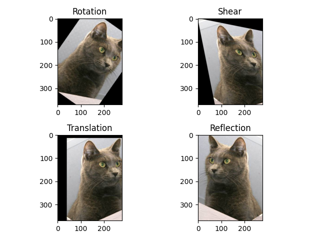

# Affine_tf

# Introduction

This is an implementation of affine transform in tensorflow 2

# Install
* Python>=3.7
* tensorflow >=2.0
* numpy

```
python setup.py install
```

# Examples



# TODO:
* batch support
* improve resample method
* refactor